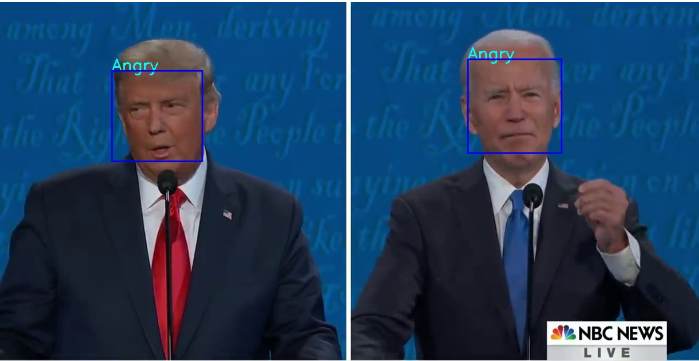
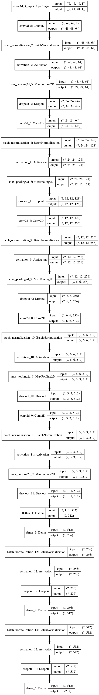

# Facial Expression Recognition

In this project, I built a deep learning model in Keras using Convolutional Neural Networks (CNNs) for facial expression recognition.

This project also makes use of the Haar Cascade algorithm for object detection and is deployed in a website using Flask.

# Model

The CNN model is very simple, it has 5 convolutional neural networks with a Dropout rate of <code>0.25</code> and Batch Normalization and 2 Fully connected layers with a Dropout rate of 0.25 and Batch Normalization as well.

This model uses the Adam optimizer with a learning rate of <code>0.0005</code> and categorical cross entropy loss.

The model was trained in 20 epochs and achieved an in-sample accuracy of <code>68.1%</code> and out-of-sample accuracy of <code>64.4%</code>.

# Libraries used

<code>tensorflow = 2.5.0</code>

<code>numpy</code>
 

<code>seaborn</code>

<code>livelossplot</code>
 

# How to use?

This algorithm can recognize and classify faceial expression on videos.

To input your own file, you can simply modify the file called camera.py and replace the string "videos/F&F9_Reaction2.mp4" with the file you choose or write 0 if you want to use your webcam instead.

<i>This code was writen for my guided project at Coursera in 2020.</i>
